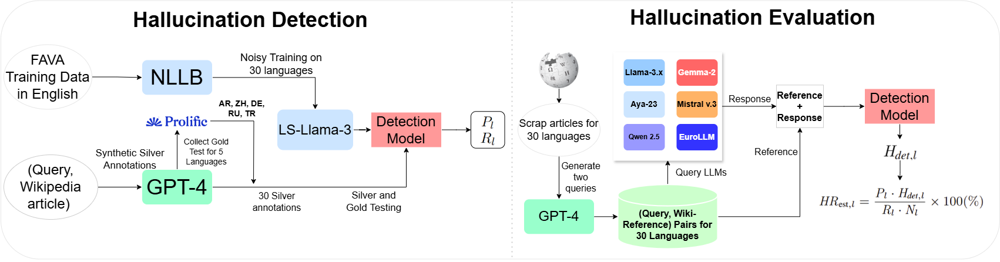

- [x] Upload Dataset and Code

- [ ] Update the main ReadMe:
  
      - [x] Archive paper link.

      - [x] Huggingface Datasets link. 

      - [x] Repository hierarchy

      - [ ] Datasets Overview.

      - [ ] Code Overview. 
          

- [ ] Add ReadMe for scripts.

      - [ ]  How-to run translations.
      
      - [ ]  How-to run preprocessing.
      
      - [ ]  How-to run training.

      - [ ]  How-to run evaluate your model.

      - [ ]  How-to run response collection.

      - [ ]  How-to run full scale detection.
             

- [ ] Add ReadMe for datasets.

      - [ ] Hallucination Detection dataset creation.

      - [ ] Hallucination Evaluation dataset creation.

# How much do LLMs hallucinate **in the wild** across languages? 
[]([https://arxiv.org/abs/2501.05122](https://arxiv.org/abs/2502.12769))
[](https://huggingface.co/collections/WueNLP/mhallucinations-llm-67b5aedb0e7fed1190e148d8) 

Repository for the paper [How Much Do LLMs Hallucinate across Languages? On Multilingual Estimation of LLM Hallucination in the Wild](https://arxiv.org/abs/2502.12769).



**Figure above illustrates our approach for estimating hallucination rates in the wild. Hallucination Detection and
Model Evaluation (left side): (1) We automatically translate the English FAVA dataset to
30 languages and train our multilingual hallucination detection (HD) model on this (noisy) multilingual training
data; (2) We synthesize a silver multilingual hallucination evaluation dataset by prompting a state-of-the-art LLM
(GPT-4) to introduce hallucinations in its answers to knowledge-seeking questions; for a subset of five high-resource
languages, we additionally collect gold (i.e., human) hallucination annotations; we dub this 30-language evaluation
benchmark MFAVA. We use MFAVA to estimate HD model’s per-language performances (precision and recall).
Hallucination Rate Estimation in the Wild (right side): (3) We estimate the hallucination rates for all 30 languages
and six different LLM families from the number of detections of the HD model and its performance.**


**Figure above shows hallucination rates of 11 Open-source LLMs across 30 languages**

### Repository Overview:
1. Datasets:
    1. Multilingual hallucination detection dataset.
    2. Multilingual hallucination evaluation dataset.
4. Scripts
    1. to develop the datasets.
    2. to translate-train and evaluate detection models.
    3. to collect responsees from LLMs on hallucination evaluation datasets.
    4. to evaluation hallucination rates of LLMs.  


# Citations

Cite our paper

```
@misc{islam2025llmshallucinatelanguagesmultilingual,
      title={How Much Do LLMs Hallucinate across Languages? On Multilingual Estimation of LLM Hallucination in the Wild}, 
      author={Saad Obaid ul Islam and Anne Lauscher and Goran Glavaš},
      year={2025},
      eprint={2502.12769},
      archivePrefix={arXiv},
      primaryClass={cs.CL},
      url={https://arxiv.org/abs/2502.12769}, 
}
```

